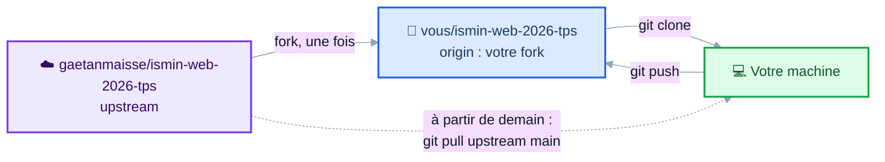
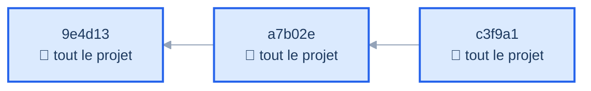
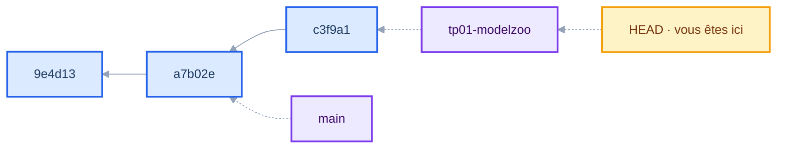
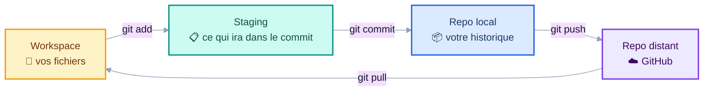
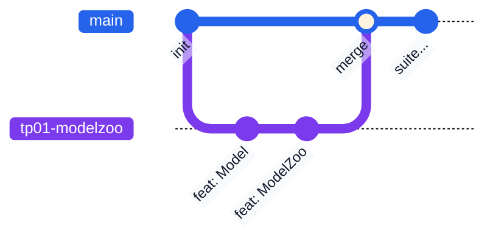

<CourseCover :sprint="1" :seance="1" />

# Développement Web

## Full-Stack TypeScript, DevOps & AI-Assisted Coding

<div class="pt-4 op-75">Séance 1: Git &amp; TypeScript</div>

<div class="pt-14 text-sm op-80">
📱 Les slides sont en ligne&nbsp; :<br/>
<b class="text-base">gaetanmaisse.github.io/ismin-web-2026-tps</b>
</div>

---
layout: center
class: text-center
---

# Vous connaissez ça&nbsp;?

<div class="text-6xl pt-2">🤗</div>

## huggingface.co

<div class="pt-4 op-75">
Le catalogue où le monde entier publie ses modèles d’IA.<br/>
Plus de <b>3 millions de modèles</b>, partagés par <b>18 millions de développeurs</b>.
</div>

<v-click>

<div class="pt-6 mx-auto max-w-2xl p-4 rounded bg-amber-500 bg-opacity-10 border-l-4 border-amber-500 text-left">
📰 <b>3 septembre 2026</b>&nbsp;: Nvidia annonce son rachat pour <b>12,9 milliards de dollars</b>.
<span class="text-sm op-75">Clôture attendue en 2027, sous réserve des autorisations réglementaires.</span>
</div>

</v-click>

<v-click>

<div class="pt-6 text-lg">
<b>On va en reconstruire une version. Et dans quatre semaines, la vôtre sera en ligne.</b>
</div>

</v-click>

---
layout: two-cols
layoutClass: gap-12
---

# Gaëtan Maisse

<div class="pt-6">
  
</div>

<div class="pt-6 text-sm op-75">
<b>@gaetanmaisse</b><br/>
GitHub · LinkedIn<br/>
<span class="op-75">Écrivez-moi si vous êtes bloqués, c’est fait pour ça.</span>
</div>

::right::

<div class="pt-16 flex flex-col gap-5">

<div>
<div class="font-bold">🎓 Mines Saint-Étienne, EI11</div>
<div class="op-75 text-sm">J’étais assis où vous êtes</div>
</div>

<div>
<div class="font-bold">👨‍💻 CTO et cofondateur de Yetty</div>
<div class="op-75 text-sm">TypeScript au quotidien, du front au déploiement</div>
</div>

<div>
<div class="font-bold">📚 Ex core team de Storybook</div>
<div class="op-75 text-sm">Open source utilisé par des dizaines de milliers de projets. Avant&nbsp;: Gravitee</div>
</div>

<div>
<div class="font-bold">👨‍🏫 Ce cours depuis dix ans</div>
<div class="op-75 text-sm">Il change tous les ans, comme le métier</div>
</div>

<div>
<div class="font-bold">🍺 🥃 🔨 ⛰️ Le reste du temps</div>
<div class="op-75 text-sm">Bières, rhums, rénovation, montagne</div>
</div>

</div>

---
layout: center
---

# 🧑‍🎓 Et vous&nbsp;?

<div class="pt-4 text-xl">

<v-clicks>

- Qui a déjà écrit du **JavaScript**&nbsp;?
- Du **HTML / CSS**&nbsp;?
- Qui a déjà fait tourner un **serveur**&nbsp;?
- Qui a déjà utilisé **Git** en équipe&nbsp;?
- Qui code déjà avec une **IA**&nbsp;? Laquelle&nbsp;?

</v-clicks>

</div>

<v-click>

<div class="mt-10 p-4 rounded bg-blue-500 bg-opacity-10">
Aucune de ces réponses n’est un prérequis. <b>Le cours part de zéro sur le web.</b>
</div>

</v-click>

---
layout: center
---

# Avant tout&nbsp;: ouvrez votre terminal

<div class="pt-6 text-left max-w-md mx-auto">

```sh
node --version
git --version
```

</div>

<div class="pt-8">

✅ `v26.` quelque chose et un numéro pour Git → parfait

🔴 Une erreur, ou pas la 26&nbsp;? **Levez la main maintenant.**

</div>

<div class="pt-8 text-sm op-75">
On règle ça pendant que je parle du programme, pas à 15 h quand il faudra coder.
</div>

---

# Comment on va travailler

<div class="grid grid-cols-2 gap-8 pt-4">
<div>

### En séance

- Posez des questions **dès** que ce n’est pas clair
- Il n’y a pas de question bête
- On alterne&nbsp;: un peu de cours, puis on code

</div>
<div>

### Entre les séances

- Rien à rendre, rien à réviser
- Trois séances par semaine, lundi / mardi / mercredi
- Ce qu’on écrit un jour sert le lendemain

</div>
</div>

<div class="mt-8 p-4 bg-blue-500 bg-opacity-10 rounded text-sm">
💡 Ne vous fatiguez pas les yeux sur votre écran quand je présente&nbsp;: les slides sont en ligne, vous les relirez.
</div>

<v-click>

<div class="mt-4 p-4 rounded border-l-4 border-blue-500 bg-blue-500 bg-opacity-5">
<b>À 16 h 30 aujourd’hui</b>, vous aurez un repo Git à votre nom avec une branch pushée,
et une classe TypeScript qui fait passer onze tests.
</div>

</v-click>

---

# Les TP en mode randori

<div class="text-sm op-75 mb-4">
Fonctionnement emprunté aux dojos de code&nbsp;: un seul clavier, et toute la salle qui réfléchit.
</div>

<div class="grid grid-cols-2 gap-8">
<div>

### Sur mon PC

- **Un pilote** au clavier&nbsp;: il tape, il ne décide pas
- **Un copilote** à côté&nbsp;: il pense à voix haute, il dicte
- Toutes les **cinq minutes**, on tourne&nbsp;: le copilote devient pilote, un nouveau copilote arrive

</div>
<div>

### Dans la salle

- On fait son TP en parallèle
- On parle quand le binôme sèche

</div>
</div>

<v-click>

<div class="mt-8 p-4 rounded border-l-4 border-blue-500 bg-blue-500 bg-opacity-5">
Dix minutes ensemble pour lancer chaque TP, puis chacun continue sur sa machine, en repartant de ce qu’on a écrit à l’écran.
</div>

</v-click>

---
layout: center
---

# Quatre semaines, quatre sprints

<div class="grid grid-cols-4 gap-4 pt-8 text-sm">

<div class="p-4 border border-gray-500 border-opacity-30 rounded">
<div class="text-xs op-60 font-mono">SEMAINE 1</div>
<div class="font-bold pt-1">Fondations & serveur</div>
<div class="pt-2 op-75">TypeScript, NestJS, connexion base de données</div>
</div>

<div class="p-4 border border-gray-500 border-opacity-30 rounded">
<div class="text-xs op-60 font-mono">SEMAINE 2</div>
<div class="font-bold pt-1">Sécurité & interface</div>
<div class="pt-2 op-75">Authentification, React</div>
</div>

<div class="p-4 border border-gray-500 border-opacity-30 rounded">
<div class="text-xs op-60 font-mono">SEMAINE 3</div>
<div class="font-bold pt-1">Fusion & qualité</div>
<div class="pt-2 op-75">Front ↔ back, tests automatisés</div>
</div>

<div class="p-4 border border-gray-500 border-opacity-30 rounded">
<div class="text-xs op-60 font-mono">SEMAINE 4</div>
<div class="font-bold pt-1">DevOps & production</div>
<div class="pt-2 op-75">Docker, CI/CD, déploiement</div>
</div>

</div>

<div class="pt-10 text-center op-75">
Chaque semaine se termine par une <b>revue</b>&nbsp;: on montre ce qui tourne.
</div>

---

# L’IA dans ce cours

Vous avez le droit (et même l’obligation) d’utiliser un assistant.

<v-clicks>

<div class="pt-4">

**Aujourd’hui**&nbsp;: celui que vous voulez, dans le navigateur. Rien à installer.
Vous n’aurez pas tous le même, et c’est tant mieux&nbsp;: on comparera leurs réponses.

**Plus tard**&nbsp;: intégré à l’éditeur, puis un agent en ligne de commande sur les séances DevOps.

</div>

<div class="mt-8 p-5 bg-amber-500 bg-opacity-10 rounded border-l-4 border-amber-500">

### ⚠️ La règle d’or

Pendant les TP, **je passe et je vous demande d’expliquer votre code**.

Si vous ne savez pas expliquer une partie, **je la supprime**.

</div>

</v-clicks>

<v-click>

<div class="pt-6 text-sm op-75">
Ce n’est pas une menace, c’est le métier&nbsp;: en entreprise, c’est vous qui passez en revue le code, qui le corrigez à 3 h du matin, et qui en répondez.
</div>

</v-click>

---
layout: section
---

# 1. Git

<div class="op-75 pt-2">Le socle du semestre, et un critère de votre note</div>

---

# Le workflow du cours

<div class="pt-2">

Vous ne pushez pas sur mon repo&nbsp;: vous travaillez sur **votre copie**.

</div>



<div class="pt-4 text-sm op-75">
<b>Aujourd’hui</b>&nbsp;: forkez, clonez, committez, poussez. Tout se passe chez vous.<br/>
<b>Dès demain</b>&nbsp;: une commande de plus pour récupérer le TP du jour depuis mon repo.
</div>

---

# Un commit est une photo, pas une différence



<v-clicks>

- Chaque commit enregistre **l’état complet** du projet, pas les lignes modifiées
- Il porte une empreinte (`c3f9a1`) et **pointe vers son parent**. L’historique est une chaîne.
- Git vous *affiche* des différences, mais il ne les *stocke* pas

</v-clicks>

<v-click>

<div class="pt-4 text-sm op-75">
C’est ce qui rend le changement de branch instantané&nbsp;: Git ne rejoue rien, il restaure une photo.
</div>

</v-click>

---

# Une branch n’est qu’un pointeur



<v-clicks>

- Une branch, c’est **un nom qui pointe vers un commit**. Rien d’autre, 40 octets sur le disque.
- La créer ne copie aucun fichier&nbsp;: c’est pour ça que c’est instantané
- `HEAD` dit sur quelle branch vous êtes. Changer de branch, `git switch`, ne fait que le déplacer.

</v-clicks>

<v-click>

<div class="pt-4 p-3 bg-blue-500 bg-opacity-10 rounded text-sm">
Vous venez du C++&nbsp;: une branch est <b>littéralement un pointeur</b>. Commiter fait avancer le pointeur d’un cran.
</div>

</v-click>

---

# Les quatre espaces de Git

<div class="flex items-center justify-center h-full pb-20">



</div>

---

# Les branches



<v-clicks>

- Une **branch** par fonctionnalité&nbsp;: on ne travaille jamais directement sur `main`
- On y travaille tranquillement, puis on la **merge** dans `main`
- `main` doit **toujours** rester dans un état qui fonctionne

</v-clicks>

<v-click>

<div class="pt-6 text-sm op-75">
En équipe, ce merge se demande par une <b>pull request</b>, et c’est là qu’on relit le code d’un collègue. Vous en ferez sur le projet final, en binôme.
</div>

</v-click>

---

# Écrire un message de commit

<div class="grid grid-cols-2 gap-6 pt-2">
<div>

### ❌ Ce qu’on voit trop

```
update
fix
ça marche
wip
truc
```

</div>
<div>

### ✅ La convention du cours

```
<type>(<portée>): <description>
```

```
feat(tp01): add getModelsByTask
fix(tp01): handle duplicate ids
docs: update README
test(tp01): cover empty catalog
```

</div>
</div>

<v-click>

<div class="pt-8 text-sm">

Types courants&nbsp;: `feat` (fonctionnalité), `fix` (correction), `docs`, `test`, `refactor`, `chore`.

**Pourquoi c’est noté**&nbsp;: dans six mois, votre historique est la seule documentation qui reste vraie.

</div>

</v-click>

---

# Savoir où on en est

<div class="grid grid-cols-2 gap-6 pt-2">
<div>

### `git status`

```sh
$ git status
On branch tp01-modelzoo
Changes not staged for commit:
  modified:   src/model-zoo.ts

Untracked files:
  src/scratch.ts
```

<div class="text-sm op-75 pt-2">
La commande à taper <b>entre chaque autre commande</b>. Elle vous dit toujours quoi faire ensuite.
</div>

</div>
<div>

### `git log`

```sh
$ git log --oneline --graph --all
* c3f9a1 (HEAD -> tp01-modelzoo)
|         feat(tp01): add ModelZoo
* a7b02e (main) chore: setup
* 9e4d13 init
```

<div class="text-sm op-75 pt-2">
<code>--graph --all</code> dessine la forme réelle de l’historique&nbsp;: le schéma des pointeurs, en vrai.
</div>

</div>
</div>

<v-click>

<div class="pt-6 text-sm op-75">
Ces deux commandes ne modifient <b>jamais</b> rien. Tapez-les sans crainte, aussi souvent que vous voulez.
</div>

</v-click>

---

# Au secours, j’ai fait une bêtise

| La situation | La commande |
|---|---|
| J’ai modifié un fichier et je veux revenir en arrière | `git restore <fichier>` |
| J’ai fait `git add` par erreur | `git restore --staged <fichier>` |
| Mon message de commit est raté | `git commit --amend` |
| J’ai commité trop tôt, je veux garder mes modifications | `git reset --soft HEAD~1` |
| Je veux voir ce que j’ai modifié | `git diff` |
| Je ne sais plus où j’en suis | `git status`, puis `git log --oneline` |

<v-click>

<div class="pt-4 p-3 bg-amber-500 bg-opacity-10 rounded text-sm">
⚠️ <code>git reset --hard</code> existe et <b>détruit vos modifications sans filet</b>. Ne le tapez pas « pour voir ».
</div>

</v-click>

<v-click>

<div class="pt-3 text-sm op-75">
Bonne nouvelle&nbsp;: tant que vous avez <b>commité</b>, presque rien n’est irrécupérable. C’est la meilleure raison de commiter souvent.
</div>

</v-click>

---
layout: center
---

# Je le fais, vous regardez, puis vous le refaites

<div class="pt-4 text-left max-w-3xl mx-auto">

```sh
# 1. Forker le repo du cours (sur GitHub, un bouton)
# 2. Récupérer ma copie
git clone https://github.com/MOI/ismin-web-2026-tps.git
cd ismin-web-2026-tps

# 3. Travailler sur une branch, et la publier tout de suite
git switch -c tp01-modelzoo
git push -u origin tp01-modelzoo

# 4. Relire ce qu'on s'apprête à enregistrer, PUIS enregistrer
git diff
git add . && git commit -m "feat(tp01): implement ModelZoo"
git push
```

</div>

---
layout: section
---

# TP · Git

<div class="op-75 pt-2"><code>tp01/README.md</code>, étape 1</div>

<div class="pt-8 text-sm inline-block text-left">

1. **Forkez** le repo du cours sur GitHub
2. **Clonez** votre fork
3. Créez la branch `tp01-modelzoo`
4. **Poussez-la** tout de suite&nbsp;: `git push -u origin tp01-modelzoo`
5. Vérifiez votre environnement&nbsp;: `node --version` → doit afficher `v26.x`

</div>

<div class="pt-8 text-sm op-75">
🖐 Bloqué&nbsp;? Levez la main.
</div>

---
layout: section
---

# 2. TypeScript

---

# L’écosystème

<div class="grid grid-cols-3 gap-4 pt-6">

<div class="p-4 border border-gray-500 border-opacity-30 rounded">
<div class="text-3xl">🟨</div>
<div class="font-bold pt-2">JavaScript</div>
<div class="pt-2 text-sm op-75">Le langage. Créé en 1995 pour animer des pages web.</div>
</div>

<div class="p-4 border border-gray-500 border-opacity-30 rounded">
<div class="text-3xl">🟩</div>
<div class="font-bold pt-2">Node.js</div>
<div class="pt-2 text-sm op-75">Le moteur JavaScript de Chrome, sorti du navigateur. Permet d’écrire des serveurs.</div>
</div>

<div class="p-4 border border-gray-500 border-opacity-30 rounded">
<div class="text-3xl">🟦</div>
<div class="font-bold pt-2">TypeScript</div>
<div class="pt-2 text-sm op-75">JavaScript + un système de types. Créé par Microsoft en 2012.</div>
</div>

</div>

<v-click>

<div class="pt-10 text-center">

**Le même langage sur le serveur et dans le navigateur.**

</div>

</v-click>

---

# Les mauvais côtés de JavaScript

<div class="grid grid-cols-2 gap-x-6 text-sm">
<div>

```js {monaco-run} {autorun:false}
console.log("" == 0)
```

```js {monaco-run} {autorun:false}
console.log("0" == 0)
```

```js {monaco-run} {autorun:false}
console.log("" == "0")
```

</div>
<div>

```js {monaco-run} {autorun:false}
console.log(1 < 3 < 2)
```

```js {monaco-run} {autorun:false}
const model = { name: "Mistral-7B", parameters: 7.2 }
console.log(model.paramaters * 2)
```

</div>
</div>

<v-click>

<div class="pt-2 p-3 bg-amber-500 bg-opacity-10 rounded text-sm">

`true`, `true`, **`false`**&nbsp;: l’égalité n’est même pas transitive.
`1 < 3 < 2` est `true`… et le reste pour n’importe quelles valeurs.
Et la faute de frappe sur `paramaters` donne `NaN`, **sans la moindre erreur**.

</div>

</v-click>

---

# Ce qu’on vient de voir

```js
""  == 0            // true  😬
"0" == 0            // true
""  == "0"          // false  → l'égalité n'est même pas transitive

1 < 3 < 2           // true  … et vrai pour n'importe quelles valeurs

const model = { name: "Mistral-7B", parameters: 7.2 };
model.paramaters * 2;   // NaN : aucune erreur, aucun avertissement
```

<v-clicks>

- Rien de tout cela ne plante&nbsp;: le programme continue, avec des valeurs fausses
- Sur trente lignes c’est agaçant. Sur cent mille, c’est une soirée perdue à chercher d’où vient un `NaN`

<div class="p-3 bg-blue-500 bg-opacity-10 rounded">

**Première règle de survie&nbsp;: toujours `===`, jamais `==`.**
Le triple égal compare sans convertir. `"" === 0` vaut `false`, comme il se doit.

</div>

</v-clicks>

---

# TypeScript met en évidence les trois

```ts twoslash
// @errors: 2367 2365 2551
"" == 0;

const x = 5;
1 < x < 3;

const model = { name: "Mistral-7B", parameters: 7.2 };
model.paramaters;
```

<div class="pt-4 text-sm op-75">
Signalé <b>dans l’éditeur</b>, avant même d’enregistrer le fichier, et bien avant l’utilisateur.
</div>

---

# Un sur-ensemble typé de JavaScript

<div class="grid grid-cols-3 gap-4 pt-6">

<div class="p-4 border border-gray-500 border-opacity-30 rounded">
<div class="font-bold">Syntaxe</div>
<div class="pt-2 text-sm op-75">Tout JavaScript valide est du TypeScript valide. Renommer un <code>.js</code> en <code>.ts</code> suffit à démarrer.</div>
</div>

<div class="p-4 border border-gray-500 border-opacity-30 rounded">
<div class="font-bold">Types</div>
<div class="pt-2 text-sm op-75">Une couche de règles sur ce qu’on a le droit de faire de chaque valeur. C’est le seul ajout.</div>
</div>

<div class="p-4 border border-gray-500 border-opacity-30 rounded">
<div class="font-bold">Exécution</div>
<div class="pt-2 text-sm op-75"><b>Inchangée.</b> TypeScript ne modifie jamais le comportement de votre programme.</div>
</div>

</div>

<v-click>

<div class="mt-8 p-4 bg-blue-500 bg-opacity-10 rounded">

Autrement dit&nbsp;: **TypeScript, c’est JavaScript plus un vérificateur qui travaille à la compilation.**
Il n’a pas de moteur à lui&nbsp;: à l’exécution, c’est du JavaScript, dans le même moteur qu’avant.
Aucune bibliothèque supplémentaire, aucun surcoût à l’exécution.

</div>

</v-click>

---

# À quoi ça ressemble

```ts
const rows: number = 98_169;
const org: string = "stanfordnlp";

function show(d: Dataset): string { … }
```

<v-clicks>

<div class="pt-4">

Le type s’écrit **après** le nom, séparé par `:`. Le type de retour, **après** la parenthèse.

</div>

<div class="pt-2">

Pour un objet, on nomme sa forme avec `interface`, puis on l’utilise comme un type&nbsp;:

```ts
interface Dataset {
  name: string;
  rows: number;
}
```

</div>

</v-clicks>

---
layout: two-cols
layoutClass: gap-4
---

# Typage nominal vs structurel

**C++&nbsp;: nominal**

```cpp
struct Dataset {
  std::string name;
};

struct Benchmark {   // mêmes champs…
  std::string name;
};

void show(Dataset d);

Benchmark b;
show(b);  // ❌ refusé
```

Un objet **est** d’un type parce qu’il le **déclare**.

::right::

<div class="pt-13">

**TypeScript&nbsp;: structurel**

```ts
interface Dataset {
  name: string;
}

interface Benchmark {   // mêmes champs…
  name: string;
}

function show(d: Dataset) {}

const b: Benchmark = { name: "MMLU" };
show(b);  // ✅ accepté
```

Un objet **est** d’un type parce qu’il en a la **forme**.

<div class="pt-4 text-sm op-75">
🦆 <b>Duck typing</b>&nbsp;: « if it looks like a duck and quacks like a duck, it’s a duck »
</div>

</div>

---

# Ce qui va vous surprendre&nbsp;: les types disparaissent

<div class="grid grid-cols-2 gap-6 pt-2">
<div>

**Ce que vous écrivez**&nbsp;: `dataset.ts`

```ts
interface Dataset {
  name: string;
  rows: number;
}

const d: Dataset = load();
```

</div>
<div>

**Ce qui s’exécute**&nbsp;: `dataset.js`

```js
const d = load();
```

</div>
</div>

<v-click>

<div class="mt-6 p-4 bg-amber-500 bg-opacity-10 rounded border-l-4 border-amber-500">

`tsc`, le compilateur TypeScript, ne compile pas vers du binaire&nbsp;: il **transpile** vers du JavaScript et **efface les types**.
Ils n’existent qu’au moment de la compilation. À l’exécution, il n’en reste rien.

</div>

</v-click>

<v-click>

<div class="mt-4 text-sm op-75">
👉 Conséquence&nbsp;: quand une donnée vient de <b>l’extérieur</b> (un fichier, le réseau, un formulaire) le type ne garantit <b>rien</b>.<br/>
Il faudra la valider à l’exécution. On verra comment dès demain.
</div>

</v-click>

---

# Deux conséquences qui surprennent

<v-clicks>

<div>

### 1. `tsc` produit du JavaScript **même en cas d’erreur de type**

```sh
$ npx tsc
essai.ts:7:1 - error TS2551: Property 'paramaters' does not exist…

$ ls
essai.ts   essai.js     # ← le fichier est bien là
```

Contrairement à un compilateur C++, une erreur de type n’empêche pas la production du résultat.
C’est un **avertissement**, pas un veto.

</div>

<div>

### 2. Le programme s’exécute **exactement** de la même façon

TypeScript ne change jamais le comportement à l’exécution en fonction des types qu’il a déduits.
`4 / []` vaut `Infinity` en JavaScript&nbsp;; TypeScript refuse de le compiler, mais si vous forcez, ça vaut toujours `Infinity`.

</div>

</v-clicks>

<v-click>

<div class="pt-4 text-sm op-75">
Ces deux points font de TypeScript un outil qu’on peut adopter progressivement sur du code existant, sans rien casser.
</div>

</v-click>

---

# Le compilateur et sa configuration

<div class="grid grid-cols-2 gap-6">
<div>

`tsconfig.json`

```json
{
  "compilerOptions": {
    "target": "ES2022",
    "strict": true,
    "noUncheckedIndexedAccess": true
  }
}
```

</div>
<div>

```sh
# Vérifier les types sans rien produire
npx tsc --noEmit

# Transpiler vers du JS
npx tsc
```

</div>
</div>

<v-click>

<div class="pt-6">

### `strict: true`, non négociable

Sans ce réglage, TypeScript accepte `null` partout et se tait quand il ne connaît pas le type d’une variable&nbsp;: autant écrire du JavaScript. **Tous les projets du cours l’activent.**

<div class="pt-3 text-sm op-75">
Et pour transformer l’avertissement de la slide précédente en veto&nbsp;: <code>"noEmitOnError": true</code>.
</div>

</div>

</v-click>

---
layout: section
---

# 3. La boîte à outils

<div class="op-75 pt-2">Ce dont vous aurez besoin dans 10 minutes</div>

---

# Le piège de `var`

```js {monaco-run} {autorun:false}
function varTest() {
  var x = "Hello";
  if (true) {
    var x = 71;
    console.log(x);
  }
  console.log(x);
}

varTest()
```

<v-click>

<div class="pt-4 p-4 bg-amber-500 bg-opacity-10 rounded">

La portée de `var` est la **fonction**, pas le bloc.  Le second `x` n’est pas une nouvelle variable&nbsp;: c’est la même, écrasée.

</div>

</v-click>

<v-click>

<div class="pt-4 text-center text-lg">

👉 **N’utilisez jamais `var`. Utilisez `let` et `const`.**

</div>

</v-click>

---

# `let`, `const`, et l’inférence

```ts {1-6|8-13|15-17|all}
// let : portée de bloc, comme en C++
let total = 0;
if (true) {
  let total = 71;      // une nouvelle variable, vraiment
}
// total vaut toujours 0

// const : interdit la réaffectation…
const model = "Mistral-7B";
model = "autre";       // ❌ erreur
// … mais PAS la mutation
const models = { data: [1, 2, 3]};
models.data = [4, 5, 6];    // ✅ parfaitement légal

// Les types sont le plus souvent inférés
const org = "mistralai";     // string, inutile de l'écrire
const sizes = [7, 24];       // number[]
```

<div class="pt-2 text-sm op-75">
Par défaut&nbsp;: <code>const</code>. On passe à <code>let</code> seulement quand on a besoin de réaffecter.
</div>

---

# Les types de base

<div class="grid grid-cols-2 gap-8 pt-4">
<div>

### Primitifs

```ts
string
number      // pas de int/float
boolean
bigint
null
undefined
symbol
```

**Un seul type numérique**, pas de `int` ni de `float`.
`bigint` et `symbol` existent, vous ne les croiserez pas cette semaine.

</div>
<div>

### Fournis par TypeScript

```ts
any         // à proscrire
unknown     // le any prudent
void        // ne renvoie rien
never       // ne doit pas arriver
```

<div class="text-sm op-75 pt-2">
<code>any</code> et <code>unknown</code> méritent une slide à eux&nbsp;: c’est la suivante.
</div>

</div>
</div>

---

# `unknown` plutôt que `any`

```ts
// any : « fais-moi confiance » : le compilateur se tait, les bugs passent
const data: any = JSON.parse(raw);
data.whatever.deeply.nested;   // compile. Explose à l'exécution.

// unknown : « je ne sais pas encore » : il faut vérifier avant d'utiliser
const payload: unknown = JSON.parse(raw);
payload.name;                   // ❌ refusé
```

<v-click>

<div class="pt-2 p-2 bg-red-500 bg-opacity-10 rounded">

Dans ce cours, `any` est interdit.

</div>

</v-click>

---

# Deux syntaxes dont vous aurez besoin tout de suite

<div class="grid grid-cols-2 gap-6 pt-2">
<div>

### Template strings

```ts
const org = "mistralai";

`Modèle de ${org}`
// "Modèle de mistralai"

`1 + 1 = ${1 + 1}`
// "1 + 1 = 2"

`Les retours à la ligne
 fonctionnent aussi`
```

Avec des **backticks**, pas des guillemets.

</div>
<div>

### Lambda

```ts
// Une expression : pas de return
const double = (n: number) => n * 2;
double(7);                        // 14

// Plusieurs lignes : accolades, et return
const isLarge = (d: Dataset) => {
  const threshold = 1_000_000;
  return d.rows > threshold;
};

// Le cas courant : passée à une méthode
datasets.filter((d) => d.org === "mozilla");
```

</div>
</div>

<v-click>

<div class="pt-6 text-sm op-75">
Dans <code>(d) => …</code>, le paramètre n’a pas de type écrit&nbsp;: TypeScript le <b>déduit</b> de l’array sur lequel on appelle la méthode. Vous en écrirez une par méthode d’array, un peu plus loin.
</div>

</v-click>

---

# Interfaces&nbsp;: décrire une forme

```ts
interface Dataset {
  name: string;
  org: string;
  rows: number;
  description?: string;   // le ? rend la propriété optionnelle
}

function describe(dataset: Dataset): string {
  return `${dataset.org}/${dataset.name} : ${dataset.rows} lignes`;
}

// Duck typing : aucune déclaration d'implémentation nécessaire
describe({ name: "squad", org: "stanfordnlp", rows: 98_169 });   // ✅
```

<div class="pt-4 text-sm op-75">
<code>interface</code> décrit la <b>forme</b> d’un objet. Le mot-clé <code>type</code> fait à peu près la même chose, avec en plus les unions&nbsp;: c’est la slide suivante.<br/>
<b>Règle du cours</b>&nbsp;: <code>interface</code> pour la forme d’un objet, <code>type</code> pour tout le reste.
</div>

---

# Unions&nbsp;: exactement ces valeurs-là

```ts
type Licence =
  | "cc0-1.0"
  | "cc-by-sa-4.0"
  | "odc-by"
  | "propriétaire";

const l1: Licence = "cc0-1.0";       // ✅
const l2: Licence = "CC0-1.0";       // ❌ erreur à la compilation
const l3: Licence = "gpl-3.0";       // ❌ erreur à la compilation
```

<v-click>

<div class="pt-6">

Ni un `enum`, ni une string libre&nbsp;: **la liste exacte des valeurs autorisées**.
L’éditeur vous les propose en autocomplétion, et le compilateur refuse tout le reste.

**Au TP**&nbsp;: le champ `task` de vos modèles demande exactement ce type de déclaration.

</div>

</v-click>

---

# Génériques&nbsp;: le type entre chevrons

```ts
const datasets: Array<Dataset> = [];
const hub: Map<string, Dataset> = new Map();
```

<v-click>

<div class="pt-6">

Le type entre chevrons dit **ce que contient** l’array ou la `Map`. `Array<Dataset>` s’écrit aussi `Dataset[]`, c’est identique.

</div>

</v-click>

<v-click>

<div class="pt-6">

### `Map`&nbsp;: le dictionnaire

```ts
const hub = new Map<string, Dataset>();
hub.set(dataset.name, dataset);   // ajouter ou remplacer
hub.get("squad");                 // Dataset | undefined
hub.size;                         // nombre d'entrées
Array.from(hub.values());         // toutes les valeurs, dans un array
```

</div>

</v-click>

---

# Les classes

```ts
class DatasetCatalog {
  private readonly datasets: Dataset[] = [];

  add(dataset: Dataset): void {
    this.datasets.push(dataset);
  }

  count(): number {
    return this.datasets.length;
  }
}
```

<div class="pt-2">

Déclaration et implémentation au même endroit, et `this` toujours explicite.

</div>

<v-click>

<div class="pt-4 text-sm op-75">
<code>private</code> et <code>readonly</code> sont vérifiés à la compilation… et effacés à l’exécution.
</div>

</v-click>

---

# Le raccourci de constructeur

<div class="grid grid-cols-2 gap-4 pt-2">
<div>

**Ce que vous écririez naturellement**

```ts
class Organisation {
  id: string;
  name: string;

  constructor(id: string, name: string) {
    this.id = id;
    this.name = name;
  }
}
```

</div>
<div>

**Le raccourci TypeScript**

```ts
class Organisation {
  constructor(
    public readonly id: string,
    public readonly name: string,
  ) {}
}
```

Strictement équivalent.

</div>
</div>

<v-click>

<div class="pt-8">

Un modificateur (`public`, `private`, `readonly`) devant un paramètre de constructeur **déclare et initialise** l’attribut d’un coup.

Vous le retrouverez partout dès demain&nbsp;: c’est ainsi que NestJS reçoit ses dépendances.

</div>

</v-click>

---

# Les méthodes d’array

<div class="pt-4">

En JavaScript, on ne parcourt pas un array avec une boucle `for`&nbsp;: **on enchaîne des méthodes**.

</div>

<div class="pt-6 text-center text-2xl font-mono op-75">
.some() &nbsp; .every() &nbsp; .filter() &nbsp; .map() &nbsp; .join() &nbsp; .reduce()
</div>

<div class="pt-8 text-sm op-75">
Chacune prend une <b>lambda</b> en paramètre et l’applique à chaque élément. Aucune ne modifie l’array d’origine&nbsp;:
elles <b>renvoient un nouvel objet&nbsp;:</b> array, boolean ou string selon la méthode.
</div>

---

# Le jeu de données

```ts
type Licence = "cc0-1.0" | "cc-by-sa-4.0" | "odc-by" | "propriétaire";

interface Dataset {
  name: string;
  org: string;
  licence: Licence;
  downloads: number;
}

const datasets: Dataset[] = [
  { name: "fineweb",      org: "HuggingFaceFW", licence: "odc-by",       downloads: 1_420_000 },
  { name: "common_voice", org: "mozilla",       licence: "cc0-1.0",      downloads: 4_100_000 },
  { name: "squad",        org: "stanfordnlp",   licence: "cc-by-sa-4.0", downloads: 1_250_000 },
  { name: "fineweb-edu",  org: "HuggingFaceFW", licence: "odc-by",       downloads:   310_000 },
];
```

<div class="pt-3 text-sm op-75">
On garde cet array pour les six slides qui suivent.
</div>

---

# `.some()` et `.every()`&nbsp;: répondre par oui ou non

<div class="pt-2 text-sm op-75">Les deux renvoient un <b>boolean</b>, jamais un array.</div>

```ts
// .some() : vrai si AU MOINS UN élément satisfait la condition
datasets.some((d) => d.org === "mozilla")          // true
datasets.some((d) => d.downloads > 9_000_000)      // false

// .every() : vrai si TOUS les éléments la satisfont
datasets.every((d) => d.downloads > 0)             // true
datasets.every((d) => d.org === "HuggingFaceFW")   // false
```

<v-click>

<div class="pt-6 text-sm op-75">
Utiles pour valider&nbsp;: « est-ce que tous les datasets ont un nom&nbsp;? », « y en a-t-il au moins un sous licence cc0&nbsp;? »
</div>

</v-click>

---

# `.filter()`&nbsp;: garder certains éléments

<div class="pt-2 text-sm op-75">Renvoie un <b>nouvel array</b> avec les éléments pour lesquels la fonction renvoie <code>true</code>.</div>

```ts
datasets.filter((d) => d.org === "HuggingFaceFW")
// [ { name: "fineweb",     org: "HuggingFaceFW", … },
//   { name: "fineweb-edu", org: "HuggingFaceFW", … } ]

datasets.filter((d) => d.downloads > 2_000_000)
// [ { name: "common_voice", org: "mozilla", … } ]

datasets.filter((d) => d.licence === "propriétaire")
// []   ← aucun résultat, mais bien un array
```

<v-click>

<div class="pt-4 p-3 bg-blue-500 bg-opacity-10 rounded text-sm">
C’est exactement ce dont vous aurez besoin dans dix minutes pour <code>getModelsOf</code> et <code>getModelsByTask</code>.
</div>

</v-click>

---

# `.map()`&nbsp;: transformer chaque élément

<div class="pt-2 text-sm op-75">Renvoie un nouvel array de <b>même longueur</b>, où chaque élément a été transformé.</div>

```ts
datasets.map((d) => d.name)
// [ "fineweb", "common_voice", "squad", "fineweb-edu" ]

datasets.map((d) => d.downloads / 1_000_000)
// [ 1.42, 4.1, 1.25, 0.31 ]

datasets.map((d) => ({ nom: d.name, éditeur: d.org }))
// [ { nom: "fineweb", éditeur: "HuggingFaceFW" }, … ]
```

<v-click>

<div class="pt-4 text-sm op-75">
⚠️ <code>filter</code> garde ou jette, <code>map</code> transforme. <code>map</code> ne réduit <b>jamais</b> le nombre d’éléments.
</div>

</v-click>

---

# Les enchaîner

<div class="pt-2 text-sm op-75">Chaque méthode renvoie un array, donc on peut appeler la suivante dessus.</div>

```ts {1-2|4-6|8-11|all}
datasets.filter((d) => d.org === "HuggingFaceFW")
// [ { name: "fineweb", … }, { name: "fineweb-edu", … } ]

datasets.filter((d) => d.org === "HuggingFaceFW")
        .map((d) => d.name)
// [ "fineweb", "fineweb-edu" ]

datasets.filter((d) => d.org === "HuggingFaceFW")
        .map((d) => d.name)
        .join(", ")
// "fineweb, fineweb-edu"       ← .join() produit une string
```

<v-click>

<div class="pt-4">

Ça se lit comme une phrase&nbsp;: **garde ceux de HuggingFaceFW, prends leur nom, colle-les avec des virgules.**
La même chose en boucle `for` prendrait dix lignes et une variable temporaire.

</div>

</v-click>

---

# `.reduce()`&nbsp;: tout replier en une seule valeur

<div class="pt-2 text-sm op-75">La plus puissante&nbsp;: elle renvoie ce que vous voulez, un number, une string, un object.</div>

```ts {1-4|6-11|all}
// Un accumulateur, une valeur de départ, et on replie
datasets.reduce((total, d) => total + d.downloads, 0)
//               ↑ accumulé  ↑ élément courant     ↑ départ
// 7_080_000

// L'accumulateur peut être une Map : ici, un total par organisation
datasets.reduce((parOrg, d) => {
  const total = parOrg.get(d.org) ?? 0;   // ?? : valeur par défaut si undefined
  return parOrg.set(d.org, total + d.downloads);
}, new Map<string, number>())
// Map { "HuggingFaceFW" => 1_730_000, "mozilla" => 4_100_000, "stanfordnlp" => 1_250_000 }
```

<v-click>

<div class="pt-4 text-sm op-75">
Si <code>reduce</code> vous paraît obscur au début, c’est normal. Commencez par la version « somme », le reste viendra.
</div>

</v-click>

---

# Et `forEach`&nbsp;?

<div class="grid grid-cols-2 gap-6 pt-4">
<div>

### Il existe…

```ts
datasets.forEach((d) => {
  console.log(d.name);
});
```

Il applique la fonction à chaque élément et **ne renvoie rien**.

</div>
<div>

### …mais il ne sert qu’aux effets de bord

```ts
// ❌ ne marche pas : forEach ne renvoie rien
const noms = datasets.forEach((d) => d.name);
// noms === undefined

// ✅
const noms = datasets.map((d) => d.name);
```

</div>
</div>

<v-click>

<div class="pt-6 p-3 bg-amber-500 bg-opacity-10 rounded">
La règle&nbsp;: si vous <b>voulez un résultat</b>, utilisez <code>map</code>, <code>filter</code> ou <code>reduce</code>. <code>forEach</code> ne sert qu’à afficher ou à déclencher quelque chose.
</div>

</v-click>

---

# À vous

<div class="text-sm op-75 mb-2">Le code est exécutable ici&nbsp;: modifiez-le et relancez.</div>

```ts {monaco-run}
const datasets = [
  { name: "fineweb", org: "HuggingFaceFW", downloads: 1420000 },
  { name: "common_voice", org: "mozilla", downloads: 4100000 },
  { name: "fineweb-edu", org: "HuggingFaceFW", downloads: 310000 },
];

console.log(datasets.filter((d) => d.org === "HuggingFaceFW").map((d) => d.name));
console.log(datasets.reduce((total, d) => total + d.downloads, 0));
console.log(datasets.find((d) => d.downloads > 4000000)?.name);
```

<div class="pt-2 text-sm op-75">
<code>.find()</code> est le cousin de <code>.filter()</code>&nbsp;: il renvoie <b>le premier</b> élément trouvé, ou <code>undefined</code>. D’où le <code>?.</code>&nbsp;: on ne lit <code>.name</code> que s’il a trouvé quelque chose.
</div>

---

# Modules&nbsp;: un fichier, un module

<div class="grid grid-cols-2 gap-6 pt-2">
<div>

```ts
// dataset.ts
export interface Dataset { … }
export type Licence = …
```

```ts
// catalog.ts
import type { Dataset, Licence }
  from "./dataset.js";

export class DatasetCatalog { … }
```

</div>
<div class="pt-2">

- `export` rend une déclaration visible depuis un autre fichier
- `import` va chercher ce dont on a besoin, **et rien d’autre**

</div>
</div>

<v-click>

<div class="pt-6 text-sm op-75">
⚠️ Deux surprises dans les imports du TP&nbsp;: <code>import <b>type</b></code> précise qu’on n’importe qu’un type (il sera effacé à la compilation) et l’extension s’écrit <code>.js</code> même si le fichier est un <code>.ts</code>, parce qu’on désigne le fichier <i>produit</i>.
</div>

</v-click>

---

# Lire un test&nbsp;: parce que c’est votre énoncé

```ts
import { describe, it, expect, beforeEach } from "vitest";
import { ModelZoo } from "./model-zoo.js";   // votre classe

describe("ModelZoo", () => {           // un groupe de tests
  let zoo: ModelZoo;

  beforeEach(() => {                   // exécuté avant CHAQUE test
    zoo = new ModelZoo();
  });

  it("ajoute un modèle au catalogue", () => {    // un test = un comportement
    zoo.addModel(mistral);

    expect(zoo.getTotalNumberOfModels()).toBe(1);
    //     ↑ ce qu'on obtient        ↑ ce qu'on attend
  });
});
```

<v-click>

<div class="pt-4">

Les assertions les plus fréquentes&nbsp;: `toBe` (égalité stricte), `toEqual` (égalité en profondeur, pour les objects et arrays), `toHaveLength`, `toBeUndefined`.

**Le nom du test dit ce qui est attendu.** Lisez-les avant de coder&nbsp;: ils sont la spécification.

</div>

</v-click>

---
layout: section
---

# TP · ModelZoo

<div class="op-75 pt-2"><code>tp01/README.md</code>, étapes 2 à 4</div>

---

# On vous donne les tests. C’est tout.

<div class="text-sm pt-2">

`src/` contient **un seul fichier**&nbsp;: `model-zoo.test.ts`. Il importe deux fichiers qui n’existent pas.

</div>

```
error TS2307: Cannot find module './model.js'
error TS2307: Cannot find module './model-zoo.js'
```

<div class="grid grid-cols-2 gap-6 pt-8 text-sm">
<div class="p-4 border border-gray-500 border-opacity-30 rounded">

**① `src/model.ts`**

Les types du domaine.

</div>
<div class="p-4 border border-gray-500 border-opacity-30 rounded">

**② `src/model-zoo.ts`**

La classe `ModelZoo`.

</div>
</div>

<div class="pt-8">

Tout ce qu’il vous faut est **dans les tests**. Lisez-les en entier avant d’écrire une ligne.

</div>

---

# L’exercice IA du jour

<div class="pt-4">

Quand le compilateur vous renvoie une erreur que vous ne comprenez pas&nbsp;:

</div>

<div class="grid grid-cols-3 gap-4 pt-6 text-sm">

<div class="p-4 border border-gray-500 border-opacity-30 rounded">
<div class="font-mono text-xs op-60">1</div>
<div class="font-bold pt-1">Demandez</div>
<div class="pt-2 op-75">Collez l’erreur dans votre assistant, demandez une explication.</div>
</div>

<div class="p-4 border border-gray-500 border-opacity-30 rounded">
<div class="font-mono text-xs op-60">2</div>
<div class="font-bold pt-1">Vérifiez</div>
<div class="pt-2 op-75">Cherchez la même notion dans la doc officielle TypeScript.</div>
</div>

<div class="p-4 border border-gray-500 border-opacity-30 rounded">
<div class="font-mono text-xs op-60">3</div>
<div class="font-bold pt-1">Comparez</div>
<div class="pt-2 op-75">L’explication tenait-elle&nbsp;? Sur quoi a-t-elle dérapé&nbsp;?</div>
</div>

</div>

<div class="pt-8 text-center op-75">
Vous n’avez pas tous le même assistant&nbsp;? <b>Tant mieux.</b> Posez-lui la même question qu’à votre voisin et comparez.<br/>
On en reparle en fin de séance&nbsp;: <b>qui a pris son IA en flagrant délit d’erreur&nbsp;?</b>
</div>

---

# Si vous terminez en avance

<div class="text-sm op-75 mb-2">Écrivez le test avant l’implémentation, dans un nouveau fichier.</div>

<div class="text-sm mb-3 p-2 rounded bg-blue-500 bg-opacity-10">
<b>Échauffement</b>, dans le README&nbsp;: un total avec <code>reduce</code>, des noms par tâche en une chaîne <code>filter</code> puis <code>map</code>, les organisations sans doublon.
</div>

<v-clicks>

<div class="text-sm">

**1. L’URL typée.** Écrivez `huggingFaceUrl(model)`, qui renvoie l’adresse de la fiche du modèle.
Contrainte&nbsp;: son **type de retour** doit rendre impossible de renvoyer `"https://example.com"`. Le compilateur doit refuser, pas un test.

</div>

<div class="text-sm">

**2. Le catalogue inviolable.** Un appelant peut-il corrompre votre catalogue **depuis l’extérieur**, sans passer par `addModel`&nbsp;?
Trouvez comment, écrivez le test qui le démontre, puis rendez-le impossible.

</div>

<div class="text-sm">

**3. Regrouper.** Ajoutez `groupByTask()` qui renvoie les modèles rangés par tâche.
Contraintes&nbsp;: **un seul parcours** de l’array, et **aucun `any`** dans la signature.

</div>

<div class="text-sm">

**4. ⭐ Le catalogue générique.** Transformez `ModelZoo` en un `Catalogue<T>` réutilisable pour n’importe quelle entité, pas seulement des modèles.
Que devez-vous **exiger** de `T` pour que `getModel` fonctionne encore&nbsp;?

</div>

</v-clicks>

---
layout: center
class: text-center
---

# Pour finir le TP

<div class="pt-6 text-left max-w-md mx-auto">

```sh
git add .
git commit -m "feat(tp01): implement ModelZoo"
git log --oneline   # les types, puis la classe
git push
```

</div>

<div class="pt-6 op-75">

Avant de commiter, **relisez votre diff**&nbsp;: <code>git diff</code>.

</div>

<div class="pt-8 text-sm op-75">
Relire son propre code avant de l’enregistrer&nbsp;: le réflexe qui vous distinguera.
</div>

---

# Correction&nbsp;: comparons vos solutions

<div class="grid grid-cols-2 gap-6 pt-4">
<div>

### Approche A&nbsp;: un array

```ts
private models: Model[] = [];

addModel(model: Model): void {
  // et le doublon, on en fait quoi ?
}
```

</div>
<div>

### Approche B&nbsp;: une `Map`

```ts
private models = new Map<string, Model>();

addModel(model: Model): void {
  this.models.set(model.id, model);
}
```

</div>
</div>

<v-click>

<div class="pt-8">

Le test *« remplace un modèle déjà présent »* départage les deux&nbsp;: avec un array, il faut
chercher puis remplacer à la main&nbsp;; avec une `Map`, `set` écrase la clé et c’est fini.

**Aucune des deux n’est fausse.** L’une demande plus de code que l’autre&nbsp;: c’est ça, une décision de conception.

</div>

</v-click>

---
layout: center
class: text-center
---

# Demain

## Séance 2&nbsp;: NestJS

<div class="pt-4 text-left max-w-lg mx-auto text-sm">

```
GET /models?task=text-generation
```

```json
[{ "id": "mistral-7b-instruct-v0-3",
   "org": "mistralai", "parameters": 7.2 }]
```

</div>

<div class="pt-6 text-lg">
<b>Ça</b>, à partir du code que vous venez d’écrire.
</div>

<div class="pt-8 op-75 text-sm">
Au programme&nbsp;: le modèle client / serveur, l’asynchronisme,<br/>
et pourquoi il faut valider tout ce qui vient de l’extérieur.
</div>

<div class="pt-8 text-sm op-60">
Slides&nbsp;: gaetanmaisse.github.io/ismin-web-2026-tps<br/>
TPs&nbsp;: github.com/gaetanmaisse/ismin-web-2026-tps
</div>
