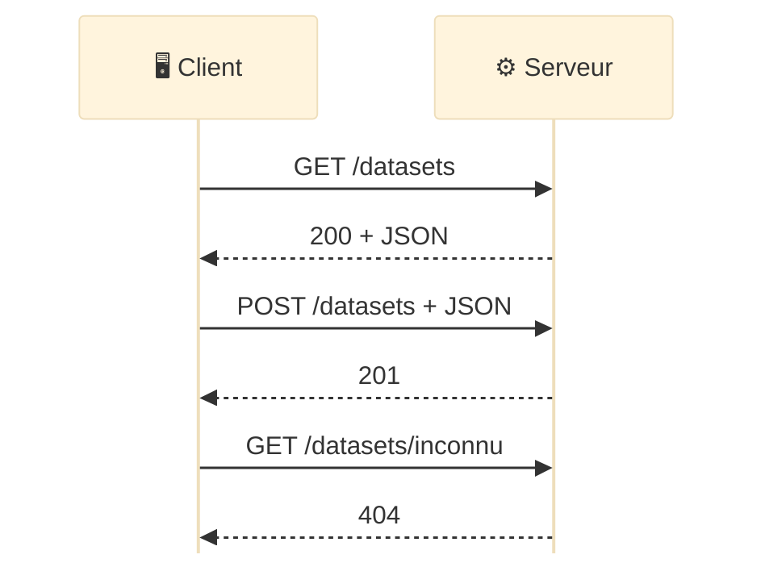
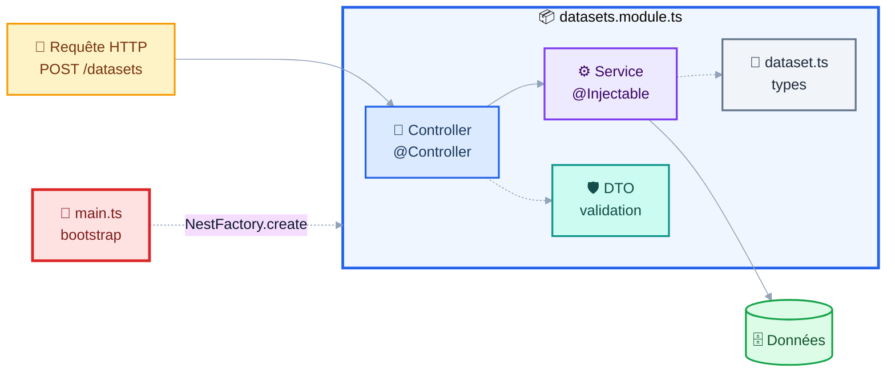
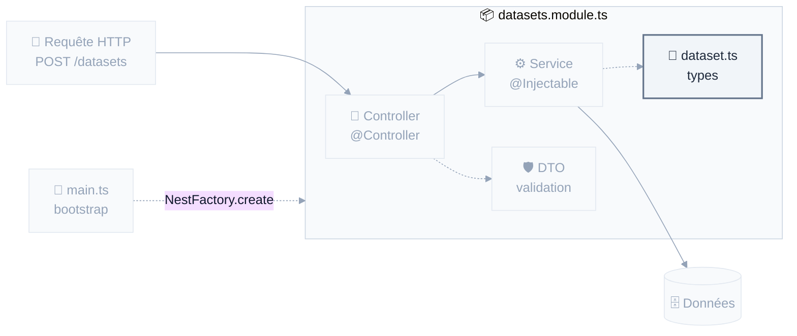
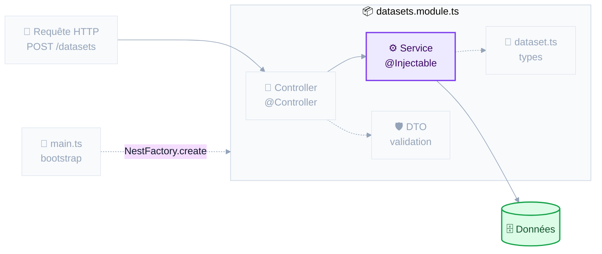
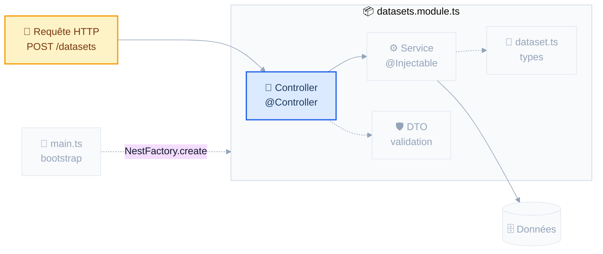
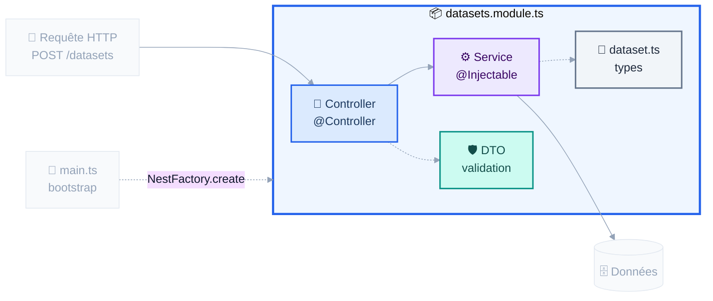
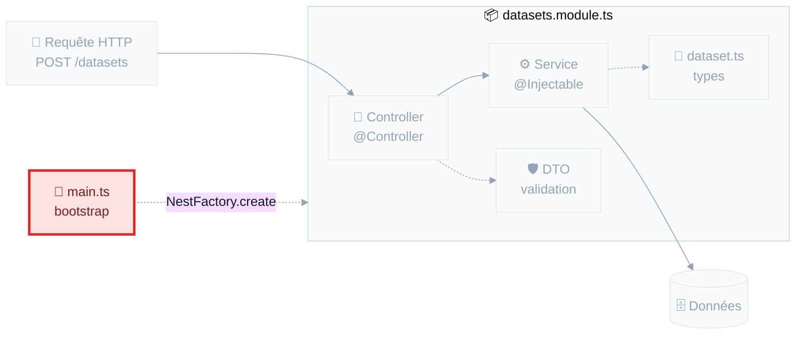
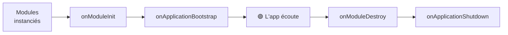
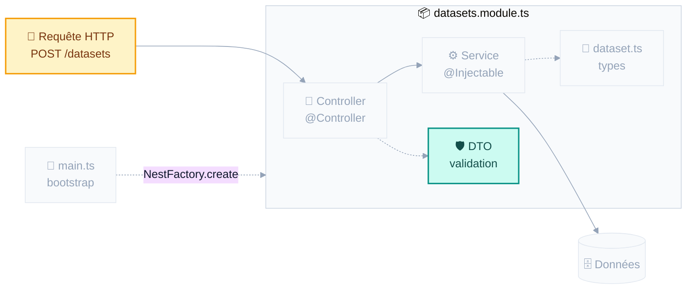

<CourseCover :sprint="1" :seance="2" />

# NestJS

## API REST & asynchronisme

<div class="pt-4 op-75">Séance 2&nbsp;: Sprint 1, Fondations & serveur</div>

<div class="pt-10 text-sm op-75">
📱 <b>gaetanmaisse.github.io/ismin-web-2026-tps</b>
</div>

---
layout: center
---

# Hier, vous avez écrit ça

```ts
const zoo = new ModelZoo();
zoo.addModel(mistral);
zoo.getModelsOf('mistralai');
```

<v-click>

<div class="pt-8 text-lg">

Le problème&nbsp;: **ça ne vit que dans votre terminal.**

</div>

</v-click>

<v-click>

<div class="pt-6 op-75">
Aujourd’hui, on rend ce catalogue interrogeable depuis n’importe où&nbsp;:<br/>
un navigateur, un téléphone, une autre application.
</div>

</v-click>

---
layout: section
---

# 1. Le web&nbsp;: JSON et REST

<div class="op-75 pt-2">On valide les bases</div>

---

# Une requête, une réponse

<div class="grid grid-cols-2 gap-6 pt-2">
<div>



</div>
<div>

```http
GET /datasets?org=mozilla HTTP/1.1
Host: api.exemple.fr
Accept: application/json

HTTP/1.1 200 OK
Content-Type: application/json

[{ "name": "common_voice", "org": "mozilla", … }]
```

<div class="text-sm pt-2">

<v-clicks>

- Le client parle en premier, le serveur ne fait que répondre
- Une requête&nbsp;: un **verbe**, un **chemin**, des en-têtes, parfois un **corps**
- Une réponse&nbsp;: un **code de statut**, des en-têtes, souvent un **corps**
- Le navigateur est un client parmi d’autres&nbsp;: Bruno, `curl`, un téléphone, une autre API

</v-clicks>

</div>

</div>
</div>

---

# JSON&nbsp;: du texte, rien d’autre

Le format d’échange du web.

```json
{
  "name": "common_voice",
  "org": "mozilla",
  "licence": "cc0-1.0",
  "rows": 1800000,
  "downloads": 4100000
}
```

<v-clicks>

- Types disponibles&nbsp;: chaîne, nombre, booléen, `null`, tableau, objet. **C’est tout.**
- Pas de date, pas de commentaire, pas de `undefined`
- En JavaScript&nbsp;: `JSON.parse(texte)` pour lire, `JSON.stringify(objet)` pour écrire

</v-clicks>

<v-click>

<div class="pt-4 p-3 bg-amber-500 bg-opacity-10 rounded text-sm">
⚠️ <code>JSON.parse</code> renvoie <code>any</code>&nbsp;: du texte venu de l’extérieur, sans garantie de forme. Traitez-le comme un <code>unknown</code>. <b>On y revient en fin de séance.</b>
</div>

</v-click>

---

# Une convention&nbsp;: des ressources, des verbes

Des **noms au pluriel**, manipulés par des **verbes** HTTP.

<div class="pt-2">

| Verbe | Chemin | Effet |
|---|---|---|
| `GET` | `/datasets` | Lister les datasets |
| `GET` | `/datasets/:id` | Lire un dataset |
| `POST` | `/datasets` | Créer un dataset, à partir du corps |
| `PUT` / `PATCH` | `/datasets/:id` | Remplacer / modifier |
| `DELETE` | `/datasets/:id` | Supprimer |

</div>

<v-click>

<div class="pt-4 text-sm op-75">
On filtre avec des paramètres de requête&nbsp;: <code>GET /datasets<b>?org=mozilla&licence=cc0-1.0</b></code><br/>
Jamais de verbe dans l’URL&nbsp;: <code>/getDatasets</code> ou <code>/datasets/delete</code> ne sont pas du REST.
</div>

</v-click>

---

# 4xx, la faute du client. 5xx, la vôtre

<div class="grid grid-cols-2 gap-6 pt-2 text-sm">
<div>

### ✅ Ça s’est bien passé

| | |
|---|---|
| `200` | OK |
| `201` | Créé (après un `POST`) |
| `204` | OK, rien à renvoyer (`DELETE`) |

### 🤷 Le client s’est trompé

| | |
|---|---|
| `400` | Requête invalide |
| `401` | Pas authentifié |
| `403` | Authentifié mais pas autorisé |
| `404` | Introuvable |

</div>
<div>

### 💥 Le serveur s’est trompé

| | |
|---|---|
| `500` | Erreur interne |
| `503` | Service indisponible |

<div class="pt-6 op-75">

Un `500` dans vos logs est toujours un bug à corriger. Un `4xx`, jamais.

</div>

</div>
</div>

---
layout: section
---

# 2. Node et npm

<div class="op-75 pt-2">L’outillage du projet</div>

---

# npm&nbsp;: le gestionnaire de paquets

<div class="grid grid-cols-2 gap-6 pt-2">
<div>

```sh
npm init              # crée package.json
npm install           # installe tout
npm install axios     # ajoute une dépendance
npm install -D vitest # ajoute une dépendance de dev

npm run start         # lance un script
npm run test
```

</div>
<div>

<div class="text-sm">

**`dependencies`**&nbsp;: nécessaires pour que l’application **tourne** (NestJS, class-validator…)

**`devDependencies`**&nbsp;: nécessaires seulement pour **développer**&nbsp;: tests, compilateur, linter. Absentes en production.

</div>

</div>
</div>

<v-clicks>

- `node_modules/` contient les paquets téléchargés. **Il ne se commite jamais**&nbsp;: il se reconstruit avec `npm install`.
- `package-lock.json`, lui, **se commite**&nbsp;: il fige les versions exactes, pour que votre machine et le serveur installent exactement la même chose.

</v-clicks>

---

# `package.json`&nbsp;: la carte d’identité du projet

```json {2-5|6-11|12-19|all}
{
  "name": "tp02-modelzoo-api",
  "private": true,
  "type": "module",
  "engines": { "node": ">=26.0.0 <27.0.0" },
  "scripts": {
    "start:dev": "nest start --watch",
    "build": "nest build",
    "test": "vitest run",
    "typecheck": "tsc --noEmit"
  },
  "dependencies": {
    "@nestjs/common": "^12.0.1",
    "class-validator": "^0.14.1"
  },
  "devDependencies": {
    "typescript": "^6.0.2",
    "vitest": "^4.1.2"
  }
}
```

<div class="pt-2 text-sm op-75">
Les <b>scripts</b> sont des raccourcis&nbsp;: on tape <code>npm run test</code>, pas la commande longue.
<code>"type": "module"</code>&nbsp;: des modules ES, comme hier, d’où les imports en <code>.js</code>.
</div>

---
layout: center
---

# ▶ Mains sur le clavier

<div class="pt-4 text-left max-w-3xl mx-auto">

```sh
# Une seule fois : déclarer le dépôt du cours comme source des TP
git remote add upstream https://github.com/gaetanmaisse/ismin-web-2026-tps.git

# À chaque séance : récupérer le TP du jour
git pull upstream main

cd tp02 && npm install
npm run start:dev
```

</div>

<div class="pt-8">

Puis ouvrez **http://localhost:3000/models** dans votre navigateur.

</div>

<v-click>

<div class="pt-6 op-75">
Une erreur&nbsp;? C’est normal&nbsp;: la route n’existe pas encore.<br/>
Mais le serveur, lui, <b>tourne</b>.
</div>

</v-click>

---
layout: section
---

# 3. NestJS

<div class="op-75 pt-2">Cinq pièces et un fil</div>

---

# Pourquoi un framework&nbsp;?

<div class="grid grid-cols-2 gap-6 pt-2">
<div>

**Node tout nu**

```ts
import http from 'node:http';

http.createServer((req, res) => {
  if (req.url === '/datasets'
      && req.method === 'GET') {
    res.writeHead(200, {
      'Content-Type': 'application/json'
    });
    res.end(JSON.stringify(datasets));
  }
  // … et 40 routes comme ça
}).listen(3000);
```

</div>
<div>

**Avec NestJS**

```ts
@Controller('datasets')
export class DatasetsController {
  @Get()
  findAll(): Dataset[] {
    return this.datasetsService.findAll();
  }
}
```

</div>
</div>

<v-clicks>

- Nest s’appuie sur **Express** et lui ajoute&nbsp;: structure, injection de dépendances, validation, gestion des erreurs
- Vous écrivez **la logique métier**, pas la plomberie

</v-clicks>

<v-click>

<div class="pt-4 text-sm op-75">
Et pourquoi pas Express seul&nbsp;? Parce qu’à cinq routes on s’en sort, à cinquante on réinvente mal ce que Nest fournit. Le coût, c’est d’apprendre ses conventions.
</div>

</v-click>

---

# Un projet Nest, fichier par fichier

<div class="grid grid-cols-2 gap-6 pt-2">
<div>

```
tp02/
├── package.json
├── nest-cli.json
├── tsconfig.json
├── vitest.config.ts
├── src
│   ├── main.ts
│   ├── app.module.ts
│   └── models
│       ├── model.ts
│       ├── model-zoo.ts
│       ├── models.module.ts
│       ├── models.controller.ts
│       ├── models.service.ts
│       └── dto/create-model.dto.ts
└── test
    └── models.e2e-spec.ts
```

</div>
<div>

<div class="text-sm pt-4">

<v-clicks>

- **`src/main.ts`**&nbsp;: le point d’entrée, qui démarre le serveur
- **`*.module.ts`**&nbsp;: les boîtes qui déclarent ce qui va ensemble
- **`*.controller.ts`**&nbsp;: les routes HTTP
- **`*.service.ts`**&nbsp;: la logique métier
- **`dto/`**&nbsp;: la forme attendue des entrées
- **`test/*.e2e-spec.ts`**&nbsp;: les tests, qui appellent l’API de bout en bout

</v-clicks>

</div>

</div>
</div>

<v-click>

<div class="pt-4 text-sm op-75">
Une convention forte&nbsp;: <b>un fichier = une responsabilité</b>, et le nom du fichier dit laquelle. <code>nest new</code> génère la même structure, vous la retrouverez dans tous les projets Nest.
</div>

</v-click>

---

# L’architecture, vue d’ensemble



---

# Les décorateurs&nbsp;: la syntaxe à connaître

Tout ce qui suit est parsemé de `@`. C’est une **annotation** qui attache des métadonnées à une classe, une méthode ou un paramètre.

```ts
@Controller('datasets')   // cette classe répond aux routes /datasets
@Get(':id')             // cette méthode répond à GET /datasets/:id
@Param('id')            // injecte ici le segment :id de l'URL
@Query('org')           // injecte ici le paramètre ?org=
@Body()                 // injecte ici le corps JSON de la requête
```

<v-click>

<div class="pt-6">

Au démarrage, Nest lit ces métadonnées et construit la table de routage.
Vous **décrivez** ce que vous voulez, le framework **câble**.

</div>

</v-click>

<v-click>

<div class="pt-4 text-sm op-75">
Rien de magique&nbsp;: ce sont des fonctions ordinaires fournies par Nest, <code>import { Controller, Get } from '@nestjs/common'</code>.
</div>

</v-click>

---
layout: center
class: text-center
---

<div class="w-full flex justify-center">



</div>

<div class="pt-2 text-2xl font-bold">① Les types</div>

---

# ① Les types&nbsp;: du TypeScript ordinaire

```ts
export type Licence = 'cc0-1.0' | 'cc-by-sa-4.0' | 'odc-by' | 'propriétaire';

export interface Dataset {
  name: string;          // identifiant, unique dans le catalogue
  org: string;
  licence: Licence;
  rows: number;
  downloads: number;
  description?: string;
}
```

<div class="pt-3 text-sm op-75">
Rien de spécifique à Nest ici&nbsp;: les mêmes interfaces et types qu’hier. Dans le TP, ce sont <b>les vôtres</b>, copiés tels quels dans <code>src/models/</code>.
</div>

---
layout: center
class: text-center
---

<div class="w-full flex justify-center">



</div>

<div class="pt-2 text-2xl font-bold">② Le service</div>

---

# ② Le service&nbsp;: la logique métier

**Ce qu’on met dans un service&nbsp;:**

<v-clicks>

- la **logique métier**&nbsp;: calculs, règles, filtrage, tri
- la **gestion du stockage**&nbsp;: lecture et écriture des données
- les **appels à des services externes**&nbsp;: autres API, envoi de mails

</v-clicks>

<v-click>

<div class="pt-3 p-3 bg-blue-500 bg-opacity-10 rounded text-sm">
Ce qu’on n’y met <b>jamais</b>&nbsp;: tout ce qui parle HTTP. Un service ne connaît ni requête, ni code de statut. Il doit être testable sans serveur.
</div>

</v-click>

---

# ② Le service, ligne par ligne

```ts {4-5|6|8-11|13-15|all}
import { Injectable } from '@nestjs/common';
import { DatasetCatalog } from './dataset-catalog.js';

@Injectable()                       // ← « Nest peut fournir cette classe »
export class DatasetsService {
  private catalog = new DatasetCatalog();   // ← la classe du cours d’hier, intacte

  create(dataset: Dataset): Dataset {
    this.catalog.add(dataset);
    return dataset;
  }

  findAll(): Dataset[] {
    return this.catalog.all();
  }
}
```

<div class="pt-3 text-sm op-75">
<code>@Injectable()</code> dit à Nest qu’il peut construire et fournir cette classe. Sans lui, Nest refuse.
</div>

---
layout: center
class: text-center
---

<div class="w-full flex justify-center">



</div>

<div class="pt-2 text-2xl font-bold">③ Le contrôleur</div>

---

# ③ Le contrôleur&nbsp;: traduire HTTP ↔ métier

```ts {1-3|5-8|all}
@Controller('datasets')           // toutes les routes commencent par /datasets
export class DatasetsController {
  constructor(private readonly datasetsService: DatasetsService) {}

  @Get()                        // GET /datasets
  findAll(): Dataset[] {
    return this.datasetsService.findAll();
  }
}
```

<div class="pt-2 text-sm op-75">
Un objet retourné devient du <b>JSON automatiquement</b>, avec un <code>200</code>. Aucune sérialisation à écrire.
</div>

---

# ③ Un contrôleur, plusieurs routes

```ts {5-9|11-16|all}
@Controller('datasets')
export class DatasetsController {
  constructor(private readonly datasetsService: DatasetsService) {}

  @Get()                                   // GET  /datasets
  findAll(): Dataset[] { … }

  @Post()                                  // POST /datasets, même chemin, autre verbe
  create(@Body() dataset: Dataset): Dataset { … }
x
  @Get(':id')                              // GET  /datasets/:id
  findOne(@Param('id') id: string): Dataset {
    const dataset = this.datasetsService.findOne(id);
    if (!dataset) throw new NotFoundException();   // Nest en fait un 404
    return dataset;
  }
}
```

<v-clicks>

- C’est le couple **(verbe, chemin)** qui choisit la méthode, pas le chemin seul
- Nest traduit l’exception en réponse&nbsp;: `NotFoundException` → **404**, `BadRequestException` → **400**

</v-clicks>

---

# ③ Vous n’écrivez jamais `new`

```ts {2|all}
export class DatasetsController {
  constructor(private readonly datasetsService: DatasetsService) {}
  //           ↑ vous n'écrivez JAMAIS new DatasetsService()
}
```

<v-clicks>

- C’est l’injection de dépendances&nbsp;: vous **déclarez** ce dont vous avez besoin, Nest vous le **fournit**
- Fonctionne pour les contrôleurs **et** pour les services entre eux
- Une seule instance de `DatasetsService` est partagée par toute l’application
- En test, on peut fournir un faux service à la place, sans changer une ligne du contrôleur

</v-clicks>

<v-click>

<div class="pt-4 p-3 bg-blue-500 bg-opacity-10 rounded text-sm">
C’est le raccourci de constructeur vu hier&nbsp;: <code>private readonly</code> devant un paramètre <b>déclare et initialise</b> l’attribut. Vous le verrez dans tous les fichiers Nest.
</div>

</v-click>

---
layout: center
class: text-center
---

<div class="w-full flex justify-center">



</div>

<div class="pt-2 text-2xl font-bold">④ Le module</div>

---

# ④ Le module&nbsp;: ce qui relie tout

```ts
import { Module } from '@nestjs/common';

@Module({
  controllers: [DatasetsController],   // les routes de ce module
  providers: [DatasetsService],        // ses fournisseurs (providers), les classes injectables
  exports: [DatasetsService],          // ce que d'autres modules peuvent réutiliser
})
export class DatasetsModule {}         // classe vide : tout est dans le décorateur
```

<div class="pt-3 p-3 bg-amber-500 bg-opacity-10 rounded text-sm">
⚠️ <b>Le piège nº 1 du TP</b>&nbsp;: un contrôleur oublié dans <code>controllers</code> ne sera <b>jamais</b> appelé. Vos routes répondront 404 sans le moindre message d’erreur. Si une route reste introuvable, vérifiez le module avant tout le reste.
</div>

---
layout: center
class: text-center
---

<div class="w-full flex justify-center">



</div>

<div class="pt-2 text-2xl font-bold">⑤ Le démarrage</div>

---

# ⑤ `main.ts`&nbsp;: le démarrage

```ts
import { NestFactory } from '@nestjs/core';
import { AppModule } from './app.module.js';

async function bootstrap() {
  const app = await NestFactory.create(AppModule);   // le module racine
  await app.listen(process.env.PORT ?? 3000);        // le port d'écoute
}
await bootstrap();                                   // await hors fonction : permis à la racine d'un module ES
```

<div class="pt-3 text-sm op-75">
Deux rendez-vous ici&nbsp;: la <b>validation globale</b>, en fin de séance&nbsp;; le port lu dans une variable d’environnement, au déploiement (séance 12).
</div>

---

# Deux terminaux, tout le TP

```sh
npm run start          # démarre l'application
npm run start:dev      # démarre + redémarre à chaque modification  ← celui du TP
npm run test           # lance les tests une fois
npm run test:watch     # les relance à chaque modification            ← celui du TP
npm run typecheck      # vérifie les types sans rien produire
npm run build          # compile vers dist/
```

<v-click>

<div class="pt-8">

Gardez **deux terminaux ouverts** pendant tout le TP&nbsp;: un pour `start:dev`, un pour `test:watch`.
Vous verrez vos erreurs apparaître sans jamais avoir à relancer quoi que ce soit.

</div>

</v-click>

---

# Interroger son API&nbsp;: Bruno

<div class="grid grid-cols-2 gap-6 pt-2">
<div>

<div class="text-sm">

Un client HTTP libre, hors ligne, sans compte.

- Composer des requêtes `GET`, `POST`, `DELETE`
- Modifier en-têtes, corps, paramètres
- Regrouper les requêtes en **collections**
- Définir des **environnements** (local, production)

</div>

<div class="pt-4 p-3 bg-blue-500 bg-opacity-10 rounded text-sm">
Ses collections sont de <b>simples fichiers texte</b>&nbsp;: elles se versionnent avec le code. Une collection prête à l’emploi est fournie dans <code>tp02/bruno/</code>.
</div>

</div>
<div>

```
tp02/bruno/
├── bruno.json
├── environments/
│   └── local.bru
├── 01-list-models.bru
├── 02-create-model.bru
├── 03-get-one-model.bru
├── 04-filter-by-org.bru
├── 05-rejects-invalid-input.bru
└── 06-delete-model.bru
```

<div class="pt-4 text-sm op-75">
Alternative sans rien installer&nbsp;: l’extension <b>REST Client</b> de VS Code, ou <code>curl</code> en ligne de commande (voir les annexes).
</div>

</div>
</div>

---
layout: section
---

# TP · partie 1

<div class="op-75 pt-2"><code>tp02/README.md</code>, étapes 0 à 3</div>

<div class="pt-8 text-sm inline-block text-left">

0. Copier votre `ModelZoo` du TP1 dans `src/models/`, ou garder le corrigé fourni
1. Lire le projet, puis câbler le module&nbsp;: il est livré vide
2. `GET /models`
3. `GET /models/:id`, avec un 404 si le modèle est inconnu

</div>

<div class="pt-8 text-sm op-75">
🖐 Bloqué&nbsp;? Levez la main.
</div>

---
layout: section
---

# 4. L’asynchronisme

<div class="op-75 pt-2">Attendre sans bloquer</div>

---

# Un service qui devient asynchrone

<div class="grid grid-cols-2 gap-4 pt-2">
<div>

**Aujourd’hui&nbsp;: tout en mémoire**

```ts
export class DatasetsService {
  create(dataset: Dataset): Dataset {
    …
  }

  findAll(): Dataset[] {
    …
  }

  findOne(id: string): Dataset | undefined {
    …
  }
}
```

</div>
<div>

**Demain, avec une base de données**

```ts
export class DatasetsService {
  create(dataset: Dataset): Promise<Dataset> {
    …
  }

  findAll(): Promise<Dataset[]> {
    …
  }

  findOne(id: string): Promise<Dataset | null> {
    …
  }
}
```

</div>
</div>

<v-click>

<div class="pt-6">

Dès qu’une seule opération devient asynchrone, **tout ce qui l’appelle le devient aussi**. C’est contagieux, et ça remonte jusqu’au contrôleur.

D’où la question suivante&nbsp;: c’est quoi, au juste, une opération asynchrone&nbsp;?

</div>

</v-click>

---

# Node exécute votre code sur un seul thread

<div class="text-sm op-75 mb-4">
Pas de <code>pthread_create</code> ici. Une seule file d’exécution, donc <b>on ne bloque jamais</b>.
</div>

<v-clicks>

- Lire un fichier, appeler une API, interroger une base&nbsp;: tout cela **prend du temps**
- Pendant ce temps, le thread doit rester libre pour traiter les autres requêtes
- Donc&nbsp;: on ne dit pas « attends le résultat », on dit **« préviens-moi quand tu l’as »**

</v-clicks>

<v-click>

<div class="pt-8 p-4 bg-blue-500 bg-opacity-10 rounded">
Conséquence directe&nbsp;: une fonction qui fait des entrées/sorties ne renvoie pas un résultat, elle renvoie une <b>promesse</b> de résultat.
</div>

</v-click>

---

# Trois façons d’écrire la même chose

````md magic-move
```ts
// ① Callbacks : l'enfer de l'imbrication
readFile('datasets.json', (err, data) => {
  if (err) return handle(err);
  parse(data, (err, datasets) => {
    if (err) return handle(err);
    save(datasets, (err) => {
      if (err) return handle(err);
      console.log('done');
    });
  });
});
```

```ts
// ② Promises : on aplatit
readFile('datasets.json')
  .then((data) => parse(data))
  .then((datasets) => save(datasets))
  .then(() => console.log('done'))
  .catch(handle);
```

```ts
// ③ async/await : on lit comme du synchrone
try {
  const data = await readFile('datasets.json');
  const datasets = await parse(data);
  await save(datasets);
  console.log('done');
} catch (err) {
  handle(err);
}
```
````

---

# `async` / `await` en pratique

```ts {1-5|7-9,18-20|11-15|all}
// async devant une fonction : elle renvoie TOUJOURS une Promise
async function loadDatasets(): Promise<Dataset[]> {
  const raw = await readFile('datasets.json', 'utf8');
  return JSON.parse(raw);        // un fichier à nous : on lui fait confiance
}

// await : dans une fonction async, ou à la racine d'un module ES
async function main() {
  const datasets = await loadDatasets();              // ✅

  // Plusieurs appels en parallèle : Promise.all
  const [locaux, distants] = await Promise.all([
    loadDatasets(),
    fetchFromHuggingFace(),
  ]);
}

function nope() {
  const datasets = await loadDatasets();              // ❌ erreur de compilation
}
```

<div class="pt-2 text-sm op-75">
<code>Promise.all</code> lance tout en même temps et attend le dernier. En série, ce serait deux fois plus lent.
</div>

---

# À vous&nbsp;: dans quel ordre&nbsp;?

```ts {monaco-run}
async function getDataset(): Promise<string> {
  return 'common_voice';
}

console.log('avant');
getDataset().then((name) => console.log(name));
console.log('après');
```

---
layout: section
---

# 5. Le cycle de vie

---

# Nest vous prévient aux moments clés



```ts {1|3-10|all}
import { Injectable, OnModuleInit } from '@nestjs/common';

@Injectable()
// implements : « je fournis cette méthode », et Nest l'appelle au bon moment
export class DatasetsService implements OnModuleInit {
  async onModuleInit(): Promise<void> {
    // le bon moment pour charger des données, ouvrir une connexion…
    await this.loadCatalogue();
  }
}
```

<div class="pt-3 text-sm op-75">
Pourquoi pas dans le constructeur&nbsp;? Parce qu’un constructeur ne peut pas être <code>async</code>. <code>onModuleInit</code>, si, et Nest l’attend avant de démarrer le serveur.
</div>

---
layout: section
---

# 6. Valider ce qui vient de l’extérieur

<div class="op-75 pt-2">Parce qu’un type n’impose rien</div>

---
layout: center
class: text-center
---

<div class="w-full flex justify-center">



</div>

<div class="pt-2 text-2xl font-bold">Le DTO&nbsp;: la pièce qui manquait</div>

---

# Un type n’impose rien

<div class="pt-2">

Souvenez-vous d’hier&nbsp;: **les types de TypeScript sont effacés à la compilation.**

</div>

```ts
@Post()
create(@Body() dataset: Dataset): Dataset {
  return this.datasetsService.create(dataset);
}
```

<v-click>

<div class="pt-4 p-4 bg-amber-500 bg-opacity-10 rounded">

Ce `: Dataset` ne vérifie **rien** à l’exécution. Si un client envoie
`{"name": 42, "rows": "beaucoup"}`, ça passe. Et ça casse plus loin, ailleurs, sans rapport apparent.

</div>

</v-click>

<v-click>

<div class="pt-6">
Le type dit ce que vous <i>espérez</i> recevoir. Il ne l’impose pas.
Pour l’imposer, il faut du code qui s’exécute.
</div>

</v-click>

---

# La solution&nbsp;: un DTO validé

<div class="text-sm op-75 mb-2">DTO = <i>Data Transfer Object</i>&nbsp;: la forme attendue d’une entrée. Ici pour les datasets du cours&nbsp;; celui des modèles, c’est l’étape 5 du TP.</div>

```ts {1-12|14-17|all}
export class CreateDatasetDto {
  @IsString()
  @IsNotEmpty()
  name!: string;          // le ! : « rempli par Nest, pas par moi »

  @IsInt()
  @Min(0)
  rows!: number;

  @IsIn(['cc0-1.0', 'cc-by-sa-4.0', 'odc-by'])
  licence!: string;
}

// Dans main.ts, une fois pour toute l'application
app.useGlobalPipes(
  new ValidationPipe({ whitelist: true, forbidNonWhitelisted: true }),
);
```

<v-click>

<div class="pt-3 text-sm op-75">
Une entrée invalide ne parvient jamais à votre service&nbsp;: Nest répond <b>400</b> avec le détail des erreurs.<br/>
<code>whitelist</code> retire les champs non déclarés, <code>forbidNonWhitelisted</code> va plus loin et refuse la requête&nbsp;: un client ne peut pas glisser de propriété surprise.
</div>

</v-click>

---
layout: section
---

# TP · partie 2

<div class="op-75 pt-2"><code>tp02/README.md</code>, étapes 4 à 6</div>

<div class="pt-8 text-sm inline-block text-left">

4. `POST /models` et `DELETE /models/:id`
5. Valider les entrées avec un DTO
6. Filtrer avec `?org=` et `?task=`

</div>

<div class="pt-6 text-sm op-75">
Bonus&nbsp;: charger le catalogue au démarrage (<code>OnModuleInit</code>), puis depuis l’API de Hugging Face
</div>

---

# Correction&nbsp;: où avez-vous mis quoi&nbsp;?

<div class="grid grid-cols-2 gap-6 pt-4">
<div>

### ❌ Logique dans le contrôleur

```ts
@Get()
findAll(@Query('org') org?: string) {
  const all = this.modelsService.findAll();
  if (org) {
    return all.filter((m) => m.org === org);
  }
  return all;
}
```

Le contrôleur fait du métier.

</div>
<div>

### ✅ Logique dans le service

```ts
@Get()
findAll(@Query('org') org?: string) {
  return this.modelsService.findAll({ org });
}
```

Le contrôleur traduit, le service décide.

</div>
</div>

<v-click>

<div class="pt-8">

**Pourquoi ça compte&nbsp;:** demain, le service passe sur une base de données. Si le filtrage est dans le contrôleur, il faudra le réécrire, et il ne profitera jamais d’un index.

</div>

</v-click>

---
layout: center
class: text-center
---

# Demain

## Séance 3&nbsp;: La persistance

<div class="pt-6 op-75">
Redémarrez votre API maintenant&nbsp;: <b>tout a disparu.</b>
</div>

<div class="pt-6">
Demain, les données survivent&nbsp;: une vraie base, des migrations,<br/>
et un client typé de bout en bout.
</div>

<div class="pt-10 text-sm op-60">
Slides&nbsp;: gaetanmaisse.github.io/ismin-web-2026-tps
</div>

---
layout: section
---

# Annexes

<div class="op-75 pt-2">Référence pendant le TP</div>

---

# Annexe · Décorateurs NestJS courants

<div class="text-sm">

| Décorateur | Rôle | Exemple |
|---|---|---|
| `@Controller('datasets')` | Préfixe de routes | `/datasets` |
| `@Get()` `@Post()` `@Delete()` | Verbe HTTP | `@Get(':id')` |
| `@Param('id')` | Segment d’URL | `/datasets/common_voice` |
| `@Query('org')` | Paramètre de requête | `/datasets?org=mozilla` |
| `@Body()` | Corps JSON de la requête | `POST` avec un DTO |
| `@HttpCode(204)` | Forcer le code de statut | après un `DELETE` |
| `@Injectable()` | Fournisseur, construit et injecté par Nest | sur les services |
| `@Module({...})` | Déclare les contrôleurs et les fournisseurs | |

</div>

<div class="pt-4 text-sm op-75">
Exceptions prêtes à l’emploi&nbsp;: <code>NotFoundException</code> (404), <code>BadRequestException</code> (400), <code>ConflictException</code> (409).
</div>

---

# Annexe · Décorateurs de validation

```ts
@IsString()  @IsNumber()  @IsBoolean()  @IsInt()
@IsNotEmpty()                    // chaîne non vide
@IsOptional()                    // le champ peut être absent
@Min(0)  @Max(100)               // bornes numériques
@IsIn(['cc0-1.0', 'odc-by'])              // valeurs autorisées
@Matches(/^v\d+\.\d+$/)          // expression régulière, ici un numéro de version
@IsArray()  @ValidateNested()    // objets imbriqués
```

<div class="pt-6 text-sm op-75">
Tous viennent de <code>class-validator</code>. La liste complète&nbsp;: <b>github.com/typestack/class-validator</b><br/>
Depuis Nest 12, l’alternative sans décorateurs&nbsp;: un schéma Zod ou Valibot passé à <code>@Body({ schema })</code>, validé par <code>StandardSchemaValidationPipe</code>. Le cours reste sur class-validator, le défaut documenté.
</div>

---

# Annexe · Interroger l’API sans Bruno

<div class="grid grid-cols-2 gap-6 pt-2 text-sm">
<div>

**En ligne de commande**

```sh
curl localhost:3000/models

curl -X POST localhost:3000/models \
  -H "Content-Type: application/json" \
  -d '{"id":"gemma-2-9b","name":"Gemma 2 9B",
       "org":"google","task":"text-generation",
       "parameters":9.2,"downloads":800000}'

curl -X DELETE localhost:3000/models/gemma-2-9b
```

</div>
<div>

**Dans l’éditeur**

Extension **REST Client** (VS Code)&nbsp;: un fichier `.http`

```http
GET http://localhost:3000/models

###

POST http://localhost:3000/models
Content-Type: application/json

{ "id": "gemma-2-9b", "name": "Gemma 2 9B",
  "org": "google", "task": "text-generation",
  "parameters": 9.2, "downloads": 800000 }
```

</div>
</div>

<div class="pt-6 text-sm op-75">
💡 Nos identifiants sont des <b>slugs</b> sans caractère spécial, donc rien à encoder. Sachez tout de même que Hugging Face utilise réellement <code>organisation/nom</code> dans ses URL, ce qui impose côté serveur un paramètre attrape-tout (<code>@Get('*id')</code>). C’est un cas particulier, pas la règle.
</div>
